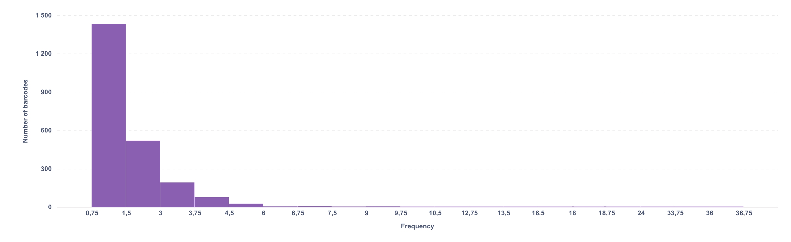

## Split into equal parts

The bar chart below shows the distribution of Frequency values grouped into 50 bins.

{ style="display:block; margin-left:auto; margin-right:auto;" }

Let’s take a look at how the score boundaries for frequency were determined when dividing customers into three equal groups. 

| f\_score | group\_size | min\_frequency | max\_frequency |
| :--- | :--- | :--- | :--- |
| 1 | 762 | 2 | 36 |
| 2 | 762 | 1 | 2 |
| 3 | 761 | 1 | 1 |

When dividing customers into three equal groups, Group 1 ended up with customers whose visit frequency varied too widely. We also see that most customers visit the pharmacy once or twice, a single visit appears in both Groups 2 and 3, and two visits fall into Groups 1 and 2. 

We can assume that pharmacies are mainly used by nearby residents, and in most large cities, several pharmacies are located within walking distance. Choosing a pharmacy is therefore determined not only by lower prices, but also by personal preference. Older customers tend to stick with familiar services rather than trying new ones; they may also prefer to discuss sensitive health-related questions with pharmacy staff they know, rather than going to a new location.

## Our choice

 We will treat Group 3 as customers who visited the pharmacy only once. These can be either new customers using the loyalty card for the first time, or customers who rarely visit the pharmacy (for example, younger customers).

 We will assign customers who visit the pharmacy two or three times to Group 2 — these may be customers who take certain medications on a daily basis and therefore require regular pharmacy visits, or simply customers who already prefer our pharmacy when they need certain products.

 Group 1 will include customers with 4 to 6 visits — within a six-week period this corresponds to weekly pharmacy visits. These may be, for example, young parents (small children often require special medications or baby products available in pharmacies), as well as older customers who visit pharmacies several times a month.

 Finally, Group 0 includes customers with more than 7 visits (the median for this group is 9 visits). Such visitors — assuming they are genuine customers and not barcodes we could not classify as for internal use — could be habitual customers who show a level of emotional attachment to the store or customers who truly need many medications.
 
| f\_score | group\_size | min\_frequency | max\_frequency |
| :--- | :--- | :--- | :--- |
| 0 | 29 | 7 | 36 |
| 1 | 111 | 4 | 6 |
| 2 | 713 | 2 | 3 |
| 3 | 1432 | 1 | 1 |

##SQL Verification  

All the SQL queries used in this section are available in the [GitHub repository](https://github.com/TAbramovskaya/SML-metabase-final-project/blob/main/sql/rfm_analysis/03_frequency_study.sql).
