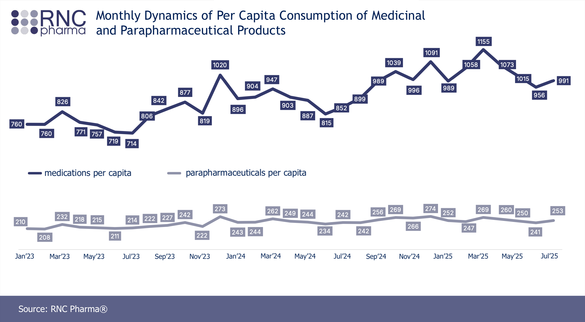
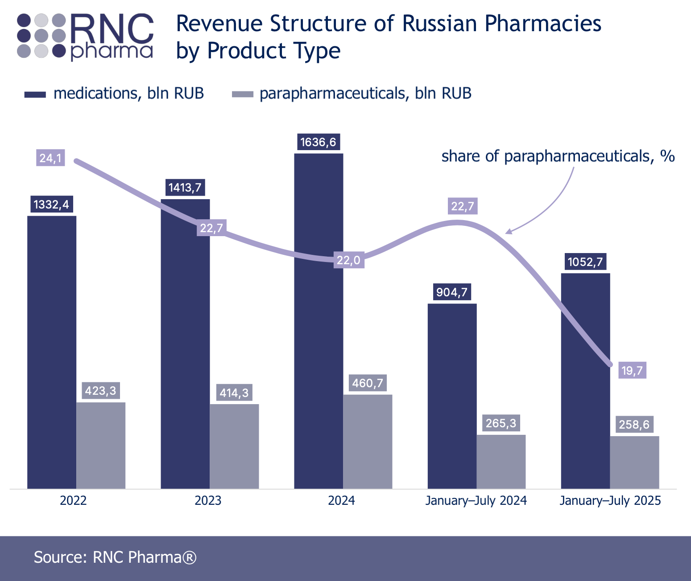
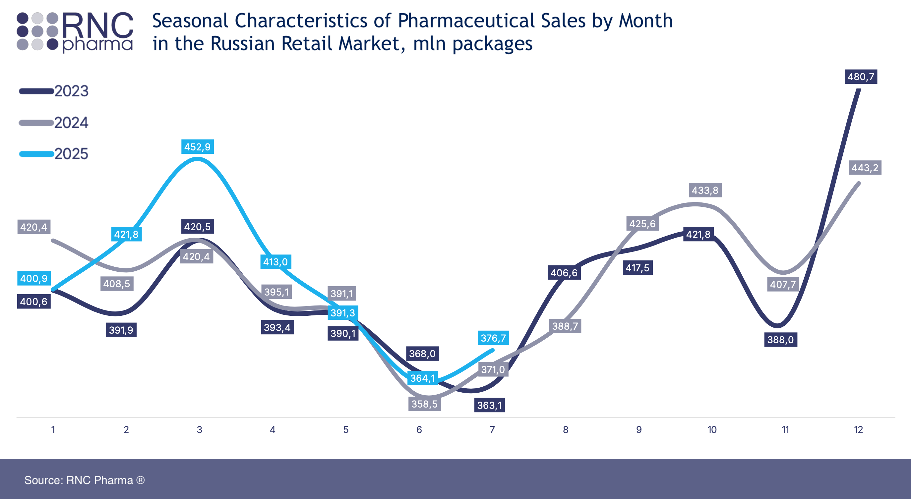

## Split into equal parts

The bar chart below shows the distribution of Monetary values grouped into 50 bins.

{ style="display:block; margin-left:auto; margin-right:auto;" }

Let’s take a look at how the score boundaries for monetary were determined when dividing customers into three equal groups.

| m\_score | group\_size | min\_monetary | max\_monetary |
| :--- | :--- | :--- | :--- |
| 1 | 762 | 1123 | 32058 |
| 2 | 762 | 389 | 1122 |
| 3 | 761 | 24 | 388 |

The median monetary value is 659 RUB, average — 745.5 RUB. We can see that the highest spending values differ from the median by two orders of magnitude.

## Some research

We will rely on publicly available research from the analytical company **RNC Pharma**. According to their analysis (see the [RNC Pharma report on seasonal sales](pdfs/rnc_pharma_rossijskaya_farmroznicza_iyul_2025.pdf), pdf, in Russian), the monthly per capita consumption of medications in 2023 and 2024 was over 800 RUB and 930 RUB, respectively. 

Note that RNC Pharma analysts distinguish between purchases of medicines and non-medicinal products offered by pharmacies (_parapharmaceuticals_: cosmetics, food supplements, etc.). So an additional approximately 200 RUB comes from parapharmaceutical consumption. We do not have data for 2022, however, the same report shows the revenue structure for 2022.

Based on the trend, we can estimate that the monthly per capita consumption of medications in 2022 was around 760 RUB, thus, including parapharmaceuticals, the monthly per capita consumption would be around 960 RUB.

Our analysis includes only actual customers (not the entire population), however, our period falls within a season of traditionally low pharmacy sales.

We can see that our average monthly spending of 745.5 RUB differs significantly from what we could estimate based on the report of monthly per capita spending. There are several possible reasons for this. First, it is a low season — we see that May-July is a period of minimal sales. Second, consumption levels can vary greatly across different regions of Russia, and we do not know which regions the pharmacies in our dataset belong to. Third, our data may be incomplete.

## Our choice

The period selected for data analysis is slightly longer than a month, but under all other assumptions, this should not have a significant impact. We will set a threshold of 5 000 RUB as the lower boundary for   Group 0 (this corresponds to the largest banknote in Russia and serves more as a psychological barrier than a data-driven value). According to the reasoning above, the range from 650 to 1050 RUB will be considered the spending limits of a "regular customer"; above this amount — customers with higher medication needs, below — customers with lower medication needs.

| m\_score | group\_size | min\_monetary | max\_monetary |
| :--- | :--- | :--- | :--- |
| 0 | 85 | 5014 | 32058 |
| 1 | 728 | 1053 | 4995 |
| 2 | 339 | 650 | 1050 |
| 3 | 1133 | 24 | 649 |

## SQL Verification  

All the SQL queries used in this section are available in the [GitHub repository](https://github.com/TAbramovskaya/SML-metabase-final-project/blob/main/sql/rfm_analysis/04_monetary_study.sql).
