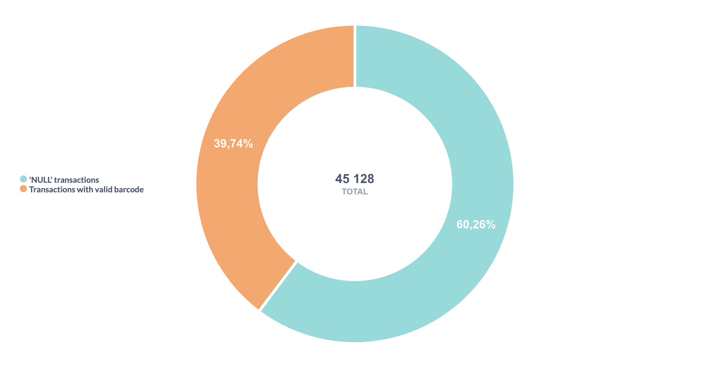
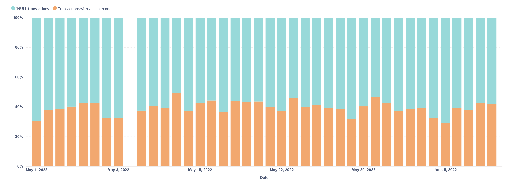

##Exploring the Data

We are examining how customer cards are represented in the `DR_BCDisc` column. We calculate how many transactions correspond to `'NULL'` barcodes and how many to valid barcodes (any string entries other than `'NULL'` are treated as valid barcode identifiers). Let’s also make sure that all cards are either marked with the string `'NULL'` or have some other string value, and that there are no SQL `null` among them.

 
Thus, we have 17 936 valid transactions, 27 192 `'NULL'`-string entries, and no transactions with an actual SQL `null` value.

The distribution of valid and invalid transactions within a single day appears consistent with the overall 40/60 ratio observed across the entire table. (May 9 is a public holiday in Russia, and many stores are closed on that day.)

Let’s examine how many distinct receipts are present in the data in total; how many of them include a valid loyalty card and how many contain a `'NULL'` barcode. 

We see that the sum of valid and `'NULL'` receipts does not equal the Total. This means that some receipts contain both items purchased with a valid loyalty card and items for which no discount was applied.

We can assume that certain product categories are not eligible for discounts. Let’s take a look at one of these receipts as an example.

| receipt | position | card | price | discount | drug\_code | drug\_name |
| :--- | :--- | :--- | :--- | :--- | :--- | :--- |
| 2297 | 1 | NULL | 395 | 0 | 4260 | ВИБРОЦИЛ 15МЛ.  |
| 2297 | 2 | NULL | 455 | 0 | 76754 | РЕННИ №24 ТАБ.Ж |
| 2297 | 3 | 200000000024 | 259 | 25 | 83115 | РОКС ЗУБ.ПАСТА  |
| 2297 | 4 | 200000000024 | 256 | 25 | 27561 | РОКС ЗУБ.ПАСТА  |
| 2297 | 5 | NULL | 121 | 0 | 72392 | СНУП 0,1% 90МКГ |
| 2297 | 6 | NULL | 121 | 0 | 72392 | СНУП 0,1% 90МКГ |
| 2297 | 7 | NULL | 446 | 0 | 31 | ТАНТУМ ВЕРДЕ 0, |

##Our Actions

We will merge the information according to the primary key so that each receipt contains data for all its items.

Receipts that contain only `'NULL'` barcodes cannot be associated with any customer, therefore, we will exclude them from the analysis.

##SQL Verification  

You can check the [GitHub repository](https://github.com/TAbramovskaya/SML-metabase-final-project/tree/main/sql/data_preprocessing/invalid_cards_overview) to review the SQL queries used in this section.
