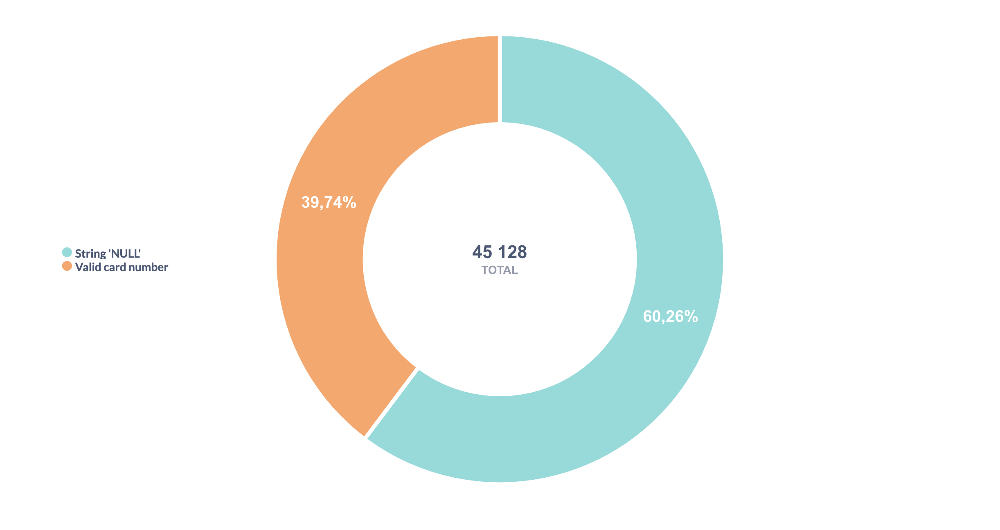
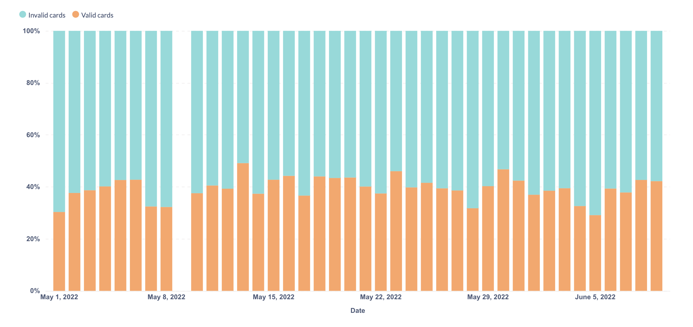
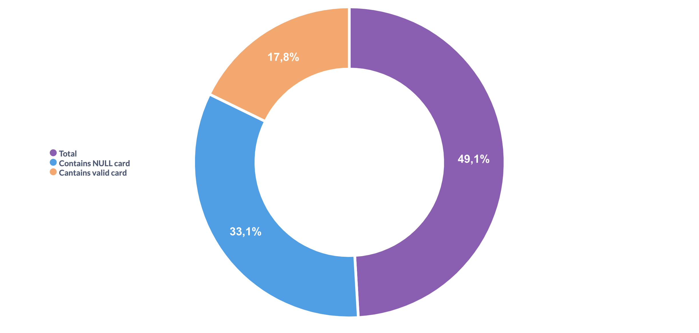

We are examining how customer cards are represented in the DR_BCDisc column. We calculate how many transactions correspond to 'NULL' cards and how many to valid cards. Let’s also make sure that all cards are either marked with the string 'NULL' or have some other string value, and that there are no SQL nulls among them.

 
Thus, we have 17 936 valid transactions (any string entries other than 'NULL' are treated as valid card identifiers), 27 192 'NULL'-string entries, and no transactions with an actual SQL null value.

The distribution of valid and invalid transactions within a single day appears consistent with the overall 40–60 ratio observed across the entire table.

Let’s examine how many distinct receipts are present in the data in total; how many of them include a valid loyalty card and how many contain a NULL card. 

We see that the sum of valid and 'NULL' receipts does not equal the Total. This means that some receipts contain both items purchased with a valid loyalty card and items for which no discount was applied.

 We can assume that certain product categories are not eligible for discounts: in the data, there are no receipts where the discount code varies — it is either the same for all items in a receipt or equal to 0 (and for such transactions, the loyalty card is recorded as 'NULL'). Let’s take a look at one of these receipts as an example.

| receipt | position | card | price | discount | drug\_code | drug\_name |
| :--- | :--- | :--- | :--- | :--- | :--- | :--- |
| 2297 | 1 | NULL | 395 | 0 | 4260 | ВИБРОЦИЛ 15МЛ.  |
| 2297 | 2 | NULL | 455 | 0 | 76754 | РЕННИ №24 ТАБ.Ж |
| 2297 | 3 | 200000000024 | 259 | 25 | 83115 | РОКС ЗУБ.ПАСТА  |
| 2297 | 4 | 200000000024 | 256 | 25 | 27561 | РОКС ЗУБ.ПАСТА  |
| 2297 | 5 | NULL | 121 | 0 | 72392 | СНУП 0,1% 90МКГ |
| 2297 | 6 | NULL | 121 | 0 | 72392 | СНУП 0,1% 90МКГ |
| 2297 | 7 | NULL | 446 | 0 | 31 | ТАНТУМ ВЕРДЕ 0, |

Although the number of such receipts is small (793 out of 7 606), we will, where possible, merge the information according to the primary key so that each receipt contains data for all its items.

Receipts that contain only NULL cards cannot be associated with any customer, therefore, we will exclude them from the analysis.
