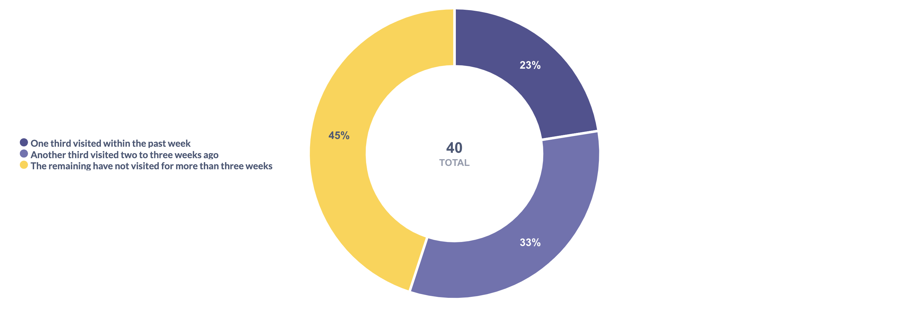

Let’s take a look at how the score boundaries for recency were determined when dividing customers into three equal groups. (Explore the [SQL queries for this section](../sql/rfm_analysis/02_recency_study.sql).)

| r\_score | group\_size | min\_recency | max\_recency |
| :--- | :--- | :--- | :--- |
| 1 | 762 | 0 | 9 |
| 2 | 762 | 9 | 21 |
| 3 | 761 | 21 | 39 |

One third of the users made their most recent purchase no more than 10 days before the final date in the dataset. We have a six-week observation window, during which more than two thirds of all customers made their last purchase in the second half of the period. We will keep this grouping but make the boundaries more precise so that customers with the same recency value do not end up in different groups. We set the upper bounds at 8 days and 21 days for Groups 1 and 2, respectively.

Now, over the 40-day period, more than two thirds of all customers visited the pharmacy during the latter half of that time.
 

| r\_score | group\_size | min\_recency | max\_recency |
| :--- | :--- | :--- | :--- |
| 1 | 736 | 0 | 8 |
| 2 | 803 | 9 | 21 |
| 3 | 746 | 22 | 39 |
