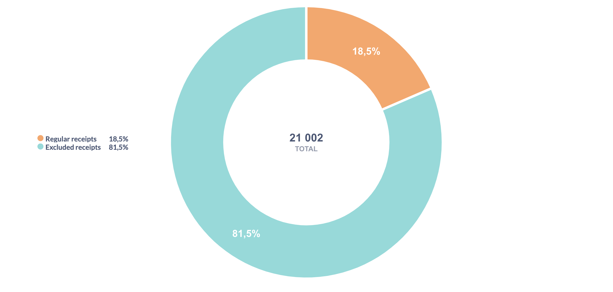
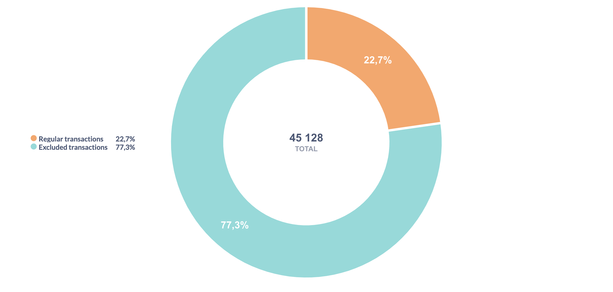

Recency (how recently a customer made a purchase). Since we are working with a limited dataset, we will treat the last day in the dataset as the zero point for recency. For each customer, we will determine the minimum number of days between their purchases and this date. We use smaller group number for more recent activity (any customer from Group 1 did his/her most recent purchase after any customer from Group 3).

 Frequency (how often they buy). As we observed during data preparation, multiple reciepts on the same day are very rare (for regular customers). Therefore, we will measure purchase frequency based on the number of reciepts, rather than the number of calendar days. We use smaller group number for higher frequency (Group 1 uses store more often than Group 3).

 Monetary value (how much they spend). We use smaller group number for users with bigger purchases (Group 1 spends more than Group 3).
 
To begin, we will compile a table containing the receipts that will serve as the basis for the RFM analysis. To do this, we will first merge all missing NULL-transactions into their corresponding receipts, then filter out the barcodes we identified as outliers as well as any receipts whose barcode remained NULL after all processing steps.

We can check what proportion of receipts will ultimately form the basis for the analysis.

The RFM analysis will be based on 18% of all receipts available in the dataset. This corresponds to 3 872 receipts, representing purchases made by 2 280 customers.

Compared to the initial dataset, the analysis will be based on 10 183 transactions, which corresponds to slightly more than one-fifth of the entire dataset.
