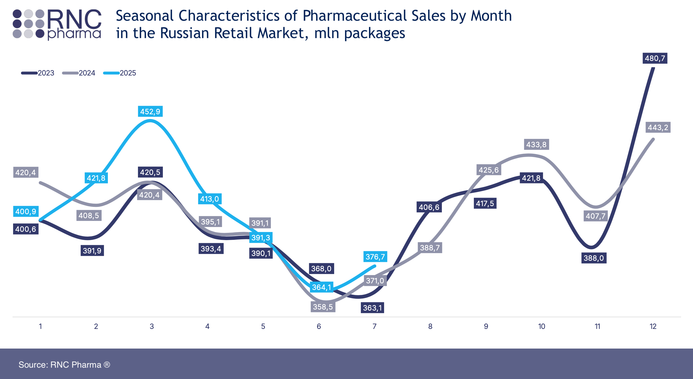

Let’s define the methodology and the labeling format for assigning users to groups.

Recency (how recently a customer made a purchase). Since we are working with a limited dataset, we will treat the last
day in the dataset as the zero point for recency. For each customer, we will determine the minimum number of days
between their purchases and this date. We use a smaller group number for more recent activity (any customer from Group 1
made his/her most recent purchase after any customer from Group 3). See the [recency study](recency_study.md).

Frequency (how often they buy). As we observed during data preparation, multiple receipts on the same day are very
rare (for regular customers). Therefore, we will measure purchase frequency based on the number of receipts rather than
the number of calendar days. We use a smaller group number for higher frequency (Group 1 uses the store more often than
Group 3). See the [frequency study](frequency_study.md).

Monetary (how much they spend). We will review publicly available research from the analytical company RNC Pharma to
determine which monetary values should be considered “average” and use them to define the boundaries between the groups.
We use a smaller group number for users with larger purchases (Group 1 spends more than Group 3). See
the [monetary study](monetary_study.md).

As a result, we obtained 37 groups. We expanded the number of groups by adding a Group 0 for both frequency and
monetary, capturing the small segment of customers with exceptional values on these metrics. You can view
the [full SQL query](../sql/rfm_analysis/05_rfm_final_scores.sql) for assigning scores according to the entire
methodology described above for each RFM metric.

The analysis period is short and, in addition, falls within a period of low demand for medicinal products. For our
analysis, we will rely on each group’s average receipt amount and average number of items per receipt.

We previously cited RNC Pharma’s statistical data in the monetary study, according to which the average receipt in 2022
was 601.8 RUB. We also know that in 2025 customers purchased, on average, 2.4–3 packages per month (see
the [RNC Pharma report on seasonal sales](pdfs/rnc_pharma_rossijskaya_farmroznicza_iyul_2025.pdf)). We do not have this
metric for 2022, but we can see that sales volumes in May–July 2023–2025 are, as expected, at their annual lows.

Therefore, we take the lower bound of range gmentioned above — 2.4 packages per month — and for our 40-day period use
the proportional estimate 2.4 × 4/3 = 3.2.

Let’s start with a small group of super performers by average receipt. (As always,
the [SQL query is available](../sql/rfm_analysis/06_average_receipt_by_group.sql) for review and verification.) They are
characterized by a low frequency (so recency is less informative), but a high average receipt (at least three times
higher than the 2022 average) and a relatively high number of packages per receipt.

| rfm | average\_receipt\_total | average\_number\_of\_items | average_discount | group\_size |
| :--- | :--- | :--- | :--- | :--- |
| 130 | 12255.25 | 9 | 4.99 | 4 |
| 230 | 6644.33 | 6.33 | 4.85 | 3 |
| 330 | 6006.89 | 9.89 | 4.91 | 9 |
| 220 | 3337.68 | 4.9 | 4.53 | 14 |
| 320 | 3297.92 | 7.08 | 4.32 | 5 |
| 120 | 2563.62 | 3.69 | 4.7 | 15 |
| 131 | 2056.24 | 3.93 | 5.02 | 70 |
| 231 | 1984.45 | 4.61 | 5.08 | 82 |
| 331 | 1968.3 | 4.46 | 5.2 | 136 |

These appear to be customers who visit the pharmacy due to a particular one-off circumstance (hence the relatively large
number of items in the receipt), who do not visit often (we see a small group of 34 people who came 2 or 3 times, the
rest only once), but who do not economize on medical products when needed.

These customers should be encouraged to return for future purchases. A limited-time special offer can be proposed, and
they should also be introduced to the pharmacy’s extended assortment. We will call this group "Generous Newcomers."

| group\_name | average\_receipt\_total | average\_number\_of\_items | average_discount | group\_size |
| :--- | :--- | :--- | :--- | :--- |
| Generous Newcomers | 2436.25 | 4.62 | 5.06 | 338 |

Next is the group of regular customers with an average receipt somewhat above, or even up to an order of magnitude
higher than, the 2022 average.

| rfm | average\_receipt\_total | average\_number\_of\_items | average_discount | group\_size |
| :--- | :--- | :--- | :--- | :--- |
| 110 | 1920.48 | 3.52 | 5.82 | 15 |
| 210 | 1326.93 | 3.6 | 5.13 | 3 |
| 321 | 964.14 | 2.89 | 5.16 | 60 |
| 221 | 935.79 | 3.15 | 5.34 | 131 |
| 121 | 924.44 | 3.05 | 5.22 | 167 |
| 200 | 812.53 | 2.63 | 5.25 | 4 |

We see that the cohort with frequency 2 and monetary 1 among them is the largest; for them (i.e., the aggregated cohort
x21), the average indicators are as follows.

| rfm | average\_receipt\_total | average\_number\_of\_items | average_discount | group\_size |
| :--- | :--- | :--- | :--- | :--- |
| x21 | 934.79 | 3.06 | 5.25 | 358 |

These are benchmark customers who prefer our pharmacy over others when needed and already have some regular requirements
for medications. Note that among these customers, 110 and 210 exceed 200 (and 100 also) — meaning customers who visited less
frequently made larger purchases (all of them are in monetary 0, i.e., spending over 5,000 rubles).

Therefore, this group should not be encouraged to visit the pharmacy more often; instead, they should be offered long-term promotions to reinforce their choice of pharmacy.

We will call this entire group "Outstanding Customers." Сюда также входят районные покупатели с высокими потребностями в
медицинских препаратах. Их следует поощрять повышением лояльности, возможностью позвонить и проверить наличие товара по
телефону.

| group\_name | average\_receipt\_total | average\_number\_of\_items | average_discount | group\_size |
| :--- | :--- | :--- | :--- | :--- |
| Outstanding Customers | 1001.43 | 3.08 | 5.27 | 380 |

Next, there is a large group with a high average receipt who visited store only once.

| rfm | average\_receipt\_total | average\_number\_of\_items | average_discount | group\_size |
| :--- | :--- | :--- | :--- | :--- |
| 332 | 700.65 | 2.69 | 5.17 | 176 |
| 132 | 690.04 | 2.44 | 5.57 | 68 |
| 232 | 686.66 | 2.91 | 5.51 | 117 |

These customers should be encouraged to return for future purchases. A limited-time special offer can be proposed, and
they should also be introduced to the pharmacy’s extended assortment. We will call this group "Promising Newcomers". Together with "Generous Newcomers" they form a strong potential to expand the Outstanding group.

| group\_name | average\_receipt\_total | average\_number\_of\_items | average_discount | group\_size |
| :--- | :--- | :--- | :--- | :--- |
| Promising Newcomers | 694.12 | 2.72 | 5.35 | 361 |

Next, for the remaining customers, we will re-sort by frequency and monetary value and identify a group of customers who
visited at least 4 times over 6 weeks.

| rfm | average\_receipt\_total | average\_number\_of\_items | average_discount | group\_size |
| :--- | :--- | :--- | :--- | :--- |
| 100 | 670.97 | 2.41 | 5.15 | 13 |
| 101 | 461.72 | 2.24 | 5.31 | 11 |
| 201 | 292.86 | 1.86 | 7.25 | 1 |
| 111 | 620.25 | 2.61 | 5.96 | 52 |
| 311 | 580.14 | 1.8 | 5.37 | 5 |
| 211 | 565.64 | 2.5 | 5.71 | 21 |
| 212 | 231.75 | 2.75 | 6.61 | 1 |
| 112 | 180.53 | 1.51 | 4.66 | 11 |
| 312 | 149.25 | 1.5 | 6.57 | 1 |
| 213 | 112.75 | 1.63 | 5.95 | 2 |

These are local customers who demonstrate a high level of trust in the pharmacy. What distinguishes them from the "Outstanding Customers" is the relatively small number of items per receipt. Such customers should be targeted with
promotions for related products, so that potential non-medical purchases are directed to our pharmacy. We will call this
group "Pharmacy Friends."

| group\_name | average\_receipt\_total | average\_number\_of\_items | average_discount | group\_size |
| :--- | :--- | :--- |:-----------------| :--- |
| Pharmacy Friends | 564.08 | 2.37 | 5.64             | 118 |

The next group demonstrates ordinary, need-based use of the pharmacy. We will call this group "Neighborhood Customers." 

| rfm | average\_receipt\_total | average\_number\_of\_items | average_discount | group\_size |
| :--- | :--- | :--- | :--- | :--- |
| 322 | 342.88 | 2.31 | 5.22 | 41 |
| 222 | 331.08 | 2.5 | 5.21 | 78 |
| 122 | 294.14 | 2.18 | 5.51 | 77 |
| 223 | 155.25 | 1.5 | 5.17 | 51 |
| 123 | 150.84 | 1.76 | 4.97 | 52 |

These customers most likely find it convenient to visit this pharmacy; the majority of them came in no more than three weeks ago, and they probably do not have a consistent need for medicinal products.

| group\_name | average\_receipt\_total | average\_number\_of\_items | average\_discount | group\_size |
| :--- | :--- | :--- | :--- | :--- |
| Neighborhood Customers | 256.12 | 2.07 | 5.21 | 321 |

The final group is a large one of one-time visitors who came at different times and did not plan to make a substantial purchase. 

| rfm | average\_receipt\_total | average\_number\_of\_items | discount | group\_size |
| :--- | :--- | :--- | :--- | :--- |
| 333 | 220.09 | 1.84 | 4.94 | 359 |
| 133 | 218.17 | 1.79 | 4.72 | 181 |
| 233 | 211.06 | 1.85 | 4.91 | 227 |

Nevertheless, they agreed to buy a loyalty card, so we will call this group the "Interested Visitors.” Our task is to remind them that they once visited our pharmacy. A short survey could also be sent to them.

| group\_name | average\_receipt\_total | average\_number\_of\_items | average\_discount | group\_size |
| :--- | :--- | :--- | :--- | :--- |
| Interested Visitors | 216.96 | 1.83 | 4.88 | 767 |

